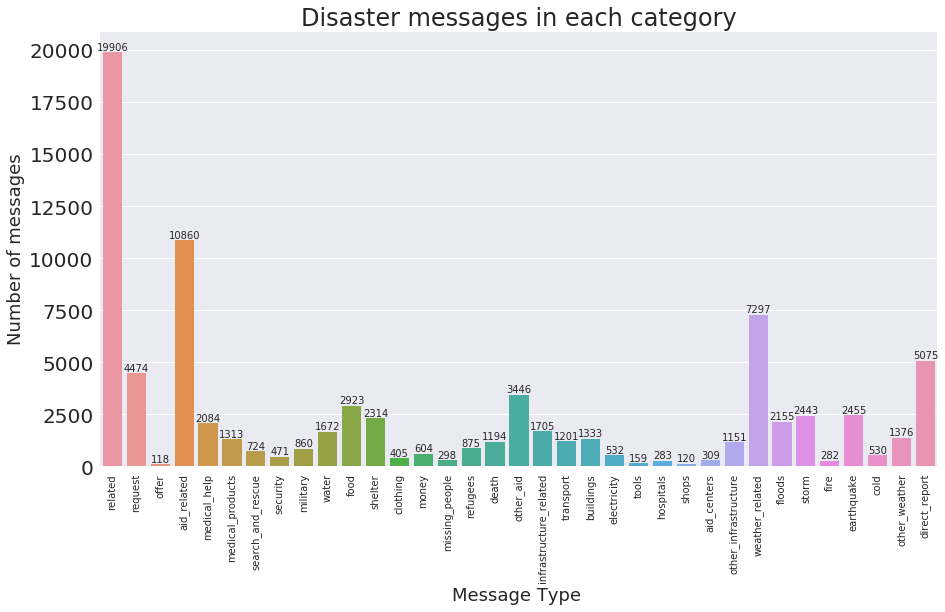
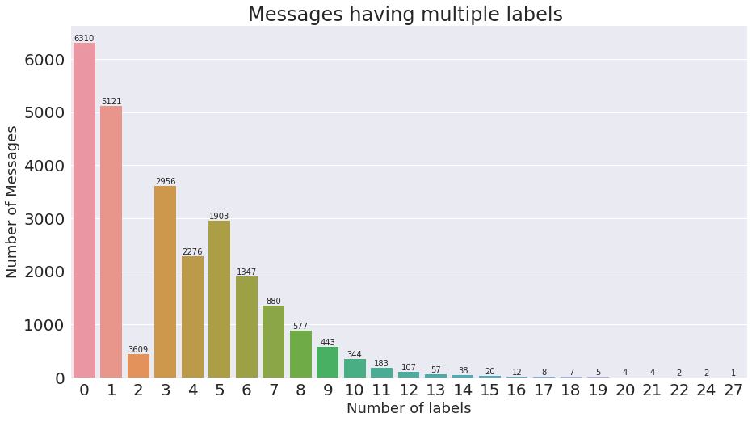
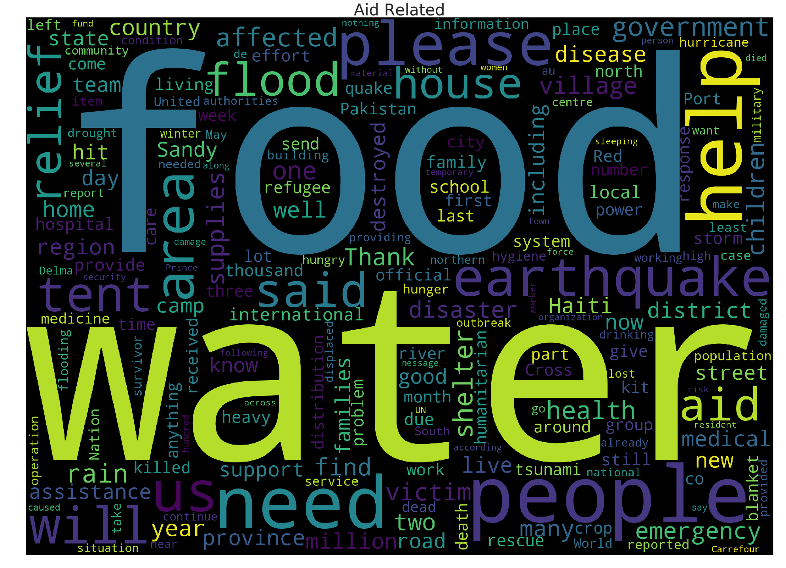
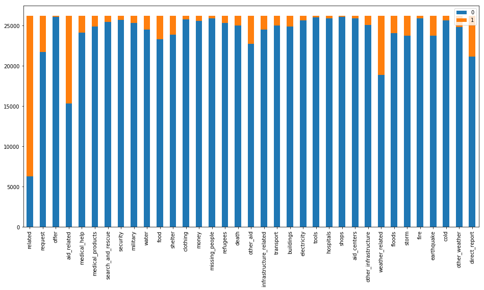

### Table of Contents

1. [Installation](#installation)
2. [Project Motivation](#motivation)
3. [File Descriptions](#files)
4. [Results](#results)
5. [Licensing, Authors, and Acknowledgements](#licensing)

## Installation 

Worked mostly with Anaconda base installation and installed packages as necessary.  pip install -r requirements.txt  

## Project Motivation

For this project, I was interested in analyzing and classifying real messages from disaster events:

1. Descriptive analysis by Extracting, Transforming, and Loading disaster messages data set.
2. How to automatically notify an appropriate agency depending on the message?
3. What can be done to help emergency workers classify disaster messages?

## File Descriptions 

There is 2 Python files and Flask web app available here to showcase work related to the above questions.  

#### ETL Pipeline - process_data.py - run this file to create the database table needed for classifier
* Loads the messages and categories dataset
* Merges the two datasets
* Cleans the data
* Stores it in a SQLite database

#### ML Pipeline - train_classifier.py - run this file to create a classfier.pkl to be used in the web app
* Loads data from the SQLite database
* Splits the dataset into training and test sets
* Builds a text processing and machine learning pipeline
* Trains and tunes a model using GridSearchCV
* Outputs results on the test set
* Exports the final model as a pickle file

#### Flask Web App
* Allows emergency worker to enter a disaster message and classify result in several categories
* Provides visualizations of the data using Plotly

## Results
Users are able to enter a disaster message via a web page and have it automatically classified to one or more categories.  
### Instructions:
1. Run the following commands in the project's root directory to set up your database and model.

    - To run ETL pipeline that cleans data and stores in database
    `python data/process_data.py data/disaster_messages.csv data/disaster_categories.csv data/DisasterResponse.db`
    - To run ML pipeline that trains classifier and saves
    `python models/train_classifier.py data/DisasterResponse.db models/classifier.pkl`
    
    - In case you would like to tune the model from scratch use 
    `python models/train_classifier.py data/DisasterResponse.db models/classifier.pkl --tune_model`

2. Run the following command in the app's directory to run your web app.
    `python run.py`

3. Go to http://0.0.0.0:3001/

### Exploratory
Data was explored to see how many messages are present for each category, how many messages contain multiple labels, check imbalance in categories, and word cloud was used to further explore the frequency of specific words within categories.

The graph shows that categories such as water, fire, death, shelter, etc messages have low count.  However, we would consider these critical and hope to have these automatically classified.

The above plot shows the number of messages having multiple categories.  5121 messages have only 1 category, 1903 with 5 categories, etc.  1 message has even 27 categories.

Here is an example of word cloud for aid related category.  Water and food are most frequent words used within this category.

### ML
Data was prepared for ML by cleaning the data to have each category in its own column and the raw message in its own column.  Raw disaster text messages were converted to numbers by using the CountVectorizer and TFIDTRansformer from sklearn.  Next, different models were compared for best performance.  SVM, RandomForest, and LogisticRegression were used in this analysis.  After brief analysis, it was determined to use GridSearchCV on two RandomForest and LogisticRegression along with a custom scorer.  Winner was Logistic Regression.

Evaluation of the model used recall instead of accuracy or precision.  Messages including water, death, food, electricity, etc were considered important and even if we got few them wrong in our automatic classification it would be okay.  Logistic regression gave the best overall recall score.  
### Improvements
Exploring the data set indicated that there is an imbalance in class labels for different categories.

As it can be seen that most of the categories are imbalanced. This made the ML task harder.  Few tricks that are typically applied to imbalanced data:
* Collect more data for imbalanced categories.  This option was not available for this project
* Change evaluation metric.  In this case, recall was used over accuracy.
* Under/Over sampling.  Maybe oversampling would be a good idea in this case.  I have used SMOTE in the past when analyzing sleep data where one category was under represented but here classification is multi-label.  Found https://github.com/niteshsukhwani/MLSMOTE.  Tried it but need to be ported to use text data.
* Get creative. Tried to see if text started with a verb.  It was not too helpful in model performance for this data set.   

## Licensing, Authors, Acknowledgements

Please give credit to author and feel free to use the code here as you would like!

